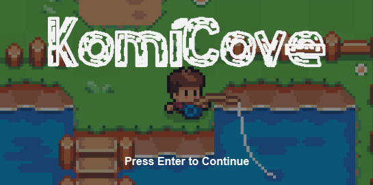
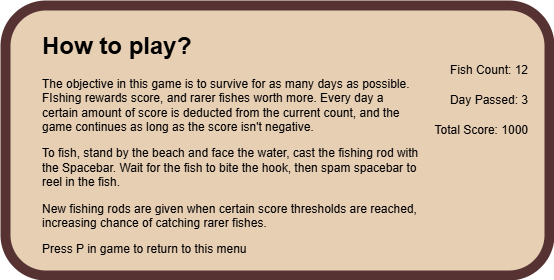
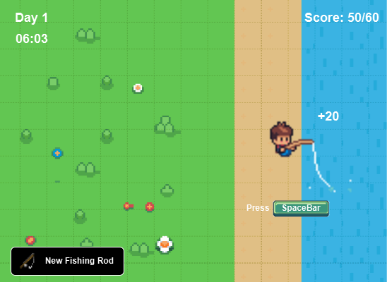
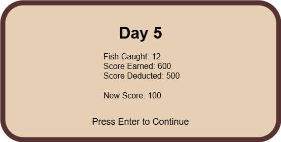

# Final Project

-   [ ] Read the [project requirements](https://vikramsinghmtl.github.io/420-5P6-Game-Programming/project/requirements).
-   [ ] Replace the sample proposal below with the one for your game idea.
-   [ ] Get the proposal greenlit by Vik.
-   [ ] Place any assets in `assets/` and remember to update `src/config.json`.
-   [ ] Decide on a height and width inside `src/globals.js`. The height and width will most likely be determined based on the size of the assets you find.
-   [ ] Start building the individual components of your game, constantly referring to the proposal you wrote to keep yourself on track.
-   [ ] Good luck, you got this!

---

# KomíCove ˖𓍢ִִ໋🦈

## ✒️ Description

Welcome to KomíCove, a tranquil yet engaging fishing game set in a picturesque seaside village. In this cozy game, players step into the role of an angler and explore the serene waters of KomíCove to catch a variety of fish, including Common, Rare, and Legendary species. Each successful catch adds to the player’s score, which is essential to surviving the day and progressing to the next. However, the journey isn’t all smooth sailing, as players must reel in fish before they escape and meet daily score thresholds within a time limit to avoid losing. As the days progress, players can unlock upgraded fishing rods that slightly boost the chances of encountering rare and legendary fish, adding a layer of excitement to this otherwise peaceful adventure.

## 🕹️ Gameplay

### Day Progression & Residue Score
At the start of each day, players cast their line and begin fishing to meet the day’s score threshold within a set timer. If the player exceeds the threshold (e.g., scores 80 points when only 50 are required), the leftover score (30 points) carries over to the next day, giving the player a head start.

### Fish Types
Players can encounter three types of fish while exploring the fish-rich waters of KomíCove:
- **Common Fish**: The most abundant and easiest to catch, offering lower score values.
- **Rare Fish**: Moderately challenging with higher score values and lower spawn rates.
- **Legendary Fish**: Exceptionally rare, highly valuable, and most likely to appear with upgraded rods.

### Fishing Mechanics
Once hooked, players must press the `SPACEBAR` repeatedly to reel in fish. Each fish has hitpoints that decrease with every press of the spacebar. If the player stops reeling or takes too long, the fish escapes. 

### Selling Fish
Fish are automatically sold as soon as they are caught, converting them into score points instantly. This ensures players consistently earn points toward meeting the day’s threshold without the risk of forgetting to sell their catch.

### Rod Upgrades
Upon reaching specific score milestones (e.g., 100 points), players are rewarded with upgraded fishing rods for free, without costing or deducting points from their total. These rods improve the chances of encountering Rare and Legendary fish.

### Win/Loss Conditions
- **Win**: Meet or exceed the daily score threshold within the time limit to progress to the next day.
- **Loss**: Fail to meet the score threshold before time runs out, results in a Game Over.

## 📃 Requirements

1. The system shall begin the game in the TitleScreenState.
2. The user shall press Enter to start the game.
3. The system shall transition to the PlayState when the game starts.
4. The system shall initialize the timer and daily score threshold at the start of each day.
5. The system shall generate fish in the fishing area, varying in type and spawn rates (Common, Rare, Legendary).
6. The system shall transition to the PlayerWalkingState, allowing the user to walk and find a fishing spot.
7. The system shall restrict the player's movement to accessible areas, such as the dock or shoreline, preventing the player from walking into the water or parts of the map not intended for gameplay.
8. The system shall allow the user to cast their fishing line from any position near a body of water.
9. The user shall press a key to cast their fishing line.
10. The system shall transition to the CastingState and display the casting animation.
11. The system shall transition to the FishingIdleState after the casting animation ends.
12. The system shall notify the user when a fish bites the hook.
13. The user shall press the SPACEBAR repeatedly to reel in the fish.
14. The system shall decrease the fish's hitpoints with each press of the SPACEBAR.
15. The system shall release the fish if the user stops reeling or takes too long to press the SPACEBAR.
16. The system shall transition to the ReelingState when the user starts reeling in a fish.
17. The system shall automatically sell the fish upon being caught, adding its score to the player's total.
18. The system shall transition to the HoldingState after a fish is caught.
19. The system shall play a successful audio cue in the HoldingState to encourage the player.
20. The system shall check the player's score when the timer runs out.
21. The system shall transition to the VictoryState if the player meets or exceeds the daily score threshold.
22. The system shall transition to the GameOverState if the player's score is below the daily threshold when the timer expires.
23. The system shall carry over any leftover score points to the next day if the player exceeds the threshold.
24. The system shall reward the user with an upgraded fishing rod upon reaching specific score milestones.
25. The system shall increase the chances of encountering Rare and Legendary fish when an upgraded rod is used.
26. The system shall transition to the MenuState when selected by the user.
27. The MenuState shall display the player's statistics, including the number of fish caught.
28. The MenuState shall include an option to view the tutorial, which will display a static page explaining gameplay.
29. The system shall allow the user to restart the game after GameOverState by pressing a key.

### 🤖 State Diagram

### 🗺️ Class Diagram

### 🧵 Wireframes

> [!note]
> Your wireframes don't have to be super polished. They can even be black/white and hand drawn. I'm just looking for a rough idea about what you're visualizing.

 Title Screen

- This screen appears after the game is opened.
- The player can press enter to proceed to the game.

 Menu Screen

- The player can press P in game to invoke the menu.
- The menu includes statistics about gameplay, instructions and introduction of the game

 Play Screen

- Gameplay takes place in this screen.
- The player can walk around and fish.
- Statistics like current day, current score and score threshold are displayed.
- A prompt is shown when the player could reel in the fish.
- A score (+XX) appears when the fish is caught, indicating its worth.
- A pop-up is displayed to show notifications such as getting new fishing rod.

 Victory Screen

- The screen shows at the end of the day if the player has enough score.
- Score of the player and other information are displayed on screen.
- From here, the player can continue to the next day by pressing enter.

 Game Over Screen

- The screen shows at the end of the day if the player doesn't have enough score.
- Score of the player and other information are displayed on screen.
- The game will restart (the player will be sent to title screen) upon enter key press.

### 🎨 Assets

We used [app.diagrams.net](https://app.diagrams.net/) to create the wireframes. Wireframes are the equivalent to the skeleton of a web app since they are used to describe the functionality of the product and the users experience.

We take inspiration from games with similar elements (fishing), such as Stardew Valley and Minecraft, and decide to find a balance between reality and game to provide players with relaxing and fun gameplay.

The GUI is kept minimalistic, with color palettes that resemble art style of in-game character and terrain - pixel, cartoon, bright.

#### 🖼️ Images

-   Most images in game (including character, equipment, tile) will be taken from [Sunnyside World](https://danieldiggle.itch.io/sunnyside), a free asset pack available on `itch.io`.

-   Certain fish icons are taken from [Bagatan Tsuri : Let's go Fishing!](https://pixerelia.itch.io/lets-go-fishing) and [Cozy Fishing](https://shubibubi.itch.io/cozy-fishing), asset packs available on `itch.io`.
-   Keyboard images for input prompt are taken from [Input Prompts Pixel 16×](https://kenney-assets.itch.io/input-prompts-pixel-16), a free asset pack on `itch.io`.

#### ✏️ Fonts

Roboto is selected for its readability.
Stardew Valley is used for the game title to place emphasis on relation between the game and nature with the wooden texture, creating a casual atmosphere suitable for relaxing gameplay.

-   [Stardew Valley](https://www.dafont.com/stardew-valley.font)
-   [Roboto](https://fonts.google.com/specimen/Roboto)

#### 🔊 Sounds

All sounds effects are taken from [pixabay.com](https://pixabay.com) and [freesound.org](https://freesound.org/).

-   [Fish Jumping Splash](https://pixabay.com/sound-effects/fish-jumping-splash-1-40948/)
-   [Fish Jumping Splash 2](https://pixabay.com/sound-effects/fish-jumping-splash-2-96871/)
-   [Splash](https://pixabay.com/sound-effects/splash-6213/)
-   [Cymbal Reverse](https://pixabay.com/sound-effects/reverse-cymbal-sound-effect-239951/)
-   [Fishing Rod Winding](https://freesound.org/people/esperri/sounds/118973/)
-   [Fishing Rod Reeling](https://freesound.org/people/j1987/sounds/95564/)

The soundtrack is taken from [www.chosic.com](https://www.chosic.com/).

-   [At The End Of All Things by Scott Buckley](https://www.chosic.com/download-audio/59300/)

### 📚 References

-   N/A
